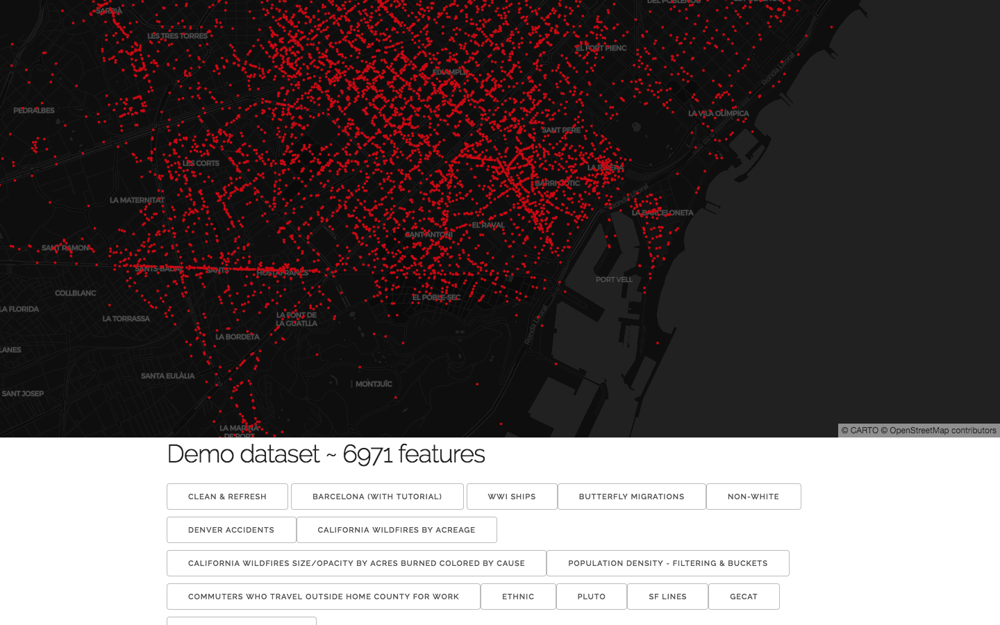

## CARTO GL



## Development

### Run the tests

```
npm test
```

### Build the library

```
npm run build
```

To watch the files

```
npm run build:watch
```

### Generate the docs

```
npm run docs
```

To generate all the docs

```
npm run docs:all
```
