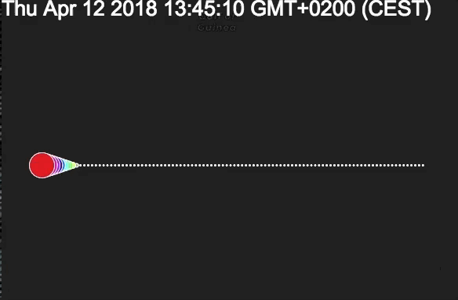

# Animations

CARTO VL provides a number of tools which can be used to create animated maps; that is, maps that change dynamically, for example showing the variation over time of some data attribute.

## Torque

The main tool for animation is the `torque` expression, which allows computing values varying in time for each feature; these values can be used to filter (i.e. show/hide) features, or to be applied to any of the styling properties (color, width, etc.). The name of this function is inspired by https://carto.com/torque/ which is a previous CARTO technology to create temporal maps. However, they are different technologies and only the CARTO VL documentation should be used to use CARTO VL `torque`.

What torque does is generate a set of cyclic values over a duration of time (10 seconds by default).

```
torque(input, duration, fade(fadeIn, fadeOut))
```

### Input value parameter

The first parameter of `torque`, the input value, is a numeric or date property expression or a generic numeric expression (in which case the [0,1] range of the expression will be used, this is very useful since you can use `linear`).
A special and common case is to use a property for this argument, in which case it will be automatically mapped to the minimum and maximum values of the property. Thus, `torque($time)` would be equivalent to
`torque(linear($time, globalMin($time), globalMax($time)))`

The `linear(value, min, max)` function applies a linear map to a value, in a way that the `min` value is mapped to 0 and the `max` value is mapped to 1. This allows to easily adjust the range of values of any expression to the [0,1] range. Values outside the [0,1] range won't appear on the animation. This means that if we have data for an entire year and we want to animate between February and June we can use: `torque(linear($month, 2, 6))`. Similarly, if we have a timestamp property `$date` in our data we could select a specific period using `time` expressions: `torque(linear($date, time('2018-01-01T00:00:00'), time('2018-01-05T00:00:00'))`

### duration parameter

Defines the duration of an animation cycle in seconds, during which all possible input values are matched in succession. When an input value is matched by the animation cycle torque returns a 1 value for the feature. A 0 value means the absence of a match. The transition between 0 and 1 will be smooth by the fade parameter.

### fade parameter

This allows defining two additional durations (in seconds) by means of the `fade` function. During the *fade-in* phase the matching result will transition from 0 to 1, and during the *fade-out* phase it will transition back to 0 again. This way, changes in features selected by torque, or in general in any style property controlled by it, can occur gradually.

## Operation

Torque will generate a cyclic value varying from 0 to 1 in the specified duration; when the input value (of a feature) coincides with the generated value torque returns a match (1 value), and otherwise, it returns a miss (0 value). If the result of torque is applied to a filter, features will appear in the map only when torque *matches* them.

The values generated by torque can be interpreted as a *simulation time* when the input values are given by a date property: in this case, the extreme 0 and 1 values correspond to the extremes of the date property. The method `getSimTime` can be applied to a torque expression to obtain the current simulation time at any moment.

The convention in CARTO VL is for 0 to represent the boolean `false` value, i.e. the notion of absence or *off* state, while 1 represents `true` (presence or *on* state). Filters or opacity act like this. But sometimes the values between 0 and 1 can also be used to represent in-between states. Filters and opacity support this interpretation by making use of partial visibility of the features (by grading their opacity/transparency). This can be a powerful animation tool.

The way for torque to generate intermediate values between 0 and 1 is by means of the fade parameter. This defines a range of values around the *current* one (i.e. a period of simulated time) for which the torque result varies between 0 and 1. The fade-in and fade-out parameters of the `fade` function are defined as a *real* time length, just like the `duration` parameter. So they can be interpreted as the fraction of the duration in which the matching transitions from 0 to 1 and back to 0 again.

## Usage

Let's see an example using a dataset which has a time property (date); We'll call the time represented in the property "simulation time" and we'll use the name `sim_time` for the property. For clarity, we'll generate a synthetic dataset in which points are placed on a horizontal segment ordered by increasing simulation time from left to right. We'll generate 100 values over one day's length.

When we supply a property as the input value, torque will automatically map it's extremes (global minimum and maximum) to 0 and 1. If we're interested in a narrower time period (e.b. because of the presence of outliers) we can manually map using linear. For example try replacing the `$sim_time` in our example by `linear($time, time('2018-04-12T00:00:00Z'), time('2018-04-12T10:00:00Z'))` to animate only a fraction of the points.

Now, during rendering, torque will compute a cyclical simulation time between the extremes of the `sim_time` property (or the extremes passed to `linear`). The duration of this cycle (in real time) is the one defined by the `duration` parameter in seconds, 10s in our case. During this cycle, simulation time varies continuously between the minimum time
(that mapped to 0) and the maximum (mapped to 1). We use `getSimTIme()` in the example to show the simulation time in the screen. In the example, we use the torque matching value to control two properties of the visualization: the size of the points and their color hue. We'll use fade in and out values so that the transition of these values becomes clearly visible.

So, at any given moment with have a torque simulation time, and the feature matching this time will have largest size assign to it as well as the red color (hue 1). Features away from it will have zero size, so only it's stroke will be visible. Features close to it (with `sim_time` values slightly larger or smaller), will have their size increase as they get closer to the *current* feature.

Here's the code for our animation demonstration:

```javascript
  const animStart = '2018-04-11T12:00:00Z';
  const animEnd = '2018-04-12T12:00:00Z';
  const animDuration = 10;
  const lineLength = 600000;

  const map = new mapboxgl.Map({
    container: 'map',
    style: 'https://basemaps.cartocdn.com/gl/dark-matter-gl-style/style.json',
    center: [0, 0],
    zoom: 6,
    dragRotate: false
  });

  carto.setDefaultAuth({
    user: 'cartogl',
    apiKey: 'default_public'
  });

  const source = new carto.source.SQL(`
    WITH params AS (
      SELECT
      -- simulation time limits:
      '${animStart}'::timestamp with time zone AS min_st,
      '${animEnd}'::timestamp with time zone AS max_st,
      0.0 AS x0, 0.0 AS y0,     -- center at the equator
      600000 AS length,         -- line length: 600 km
      100 AS n                  -- 100 points
    ),
    positions AS (
      SELECT
        step::float8/n AS s,
        x0 + (step::float8/n)*length AS x, y0 AS y
      FROM params, generate_series(1, n) AS step
    )
    SELECT
      row_number() over () AS cartodb_id,
      min_st + (max_st - min_st)*s AS sim_time,
      ST_SetSRID(ST_MakePoint(x, y),3857) AS the_geom_webmercator,
      ST_Transform(ST_SetSRID(ST_MakePoint(x, y),3857), 4326) AS the_geom
      FROM params, positions
  `);
  const s = carto.expressions;
  let torque = s.torque(s.prop('sim_time'), 5, s.fade(0.5, 1));
  setInterval(() => document.getElementById("timer").textContent = torque.getSimTime(), 100);
  let viz = new carto.Viz({
      strokeWidth: 1,
      color: s.hsv(torque, 1, 1),
      width:  s.add(1,s.mul(torque,30)),
      order: s.desc(s.width())

  });
  const layer = new carto.Layer('layer', source, viz);
  layer.addTo(map, 'watername_ocean');
```

And the result:




