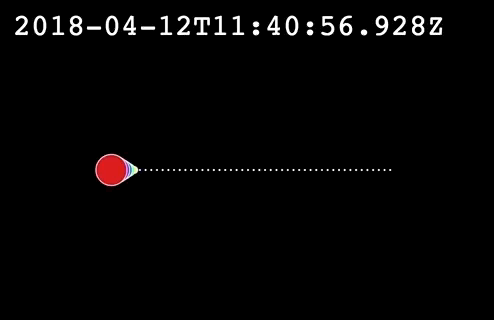

# Animations in depth

CARTO VL provides a number of tools which can be used to create animated maps; that is, maps that change dynamically, for example showing the variation over time of some data attribute.

## Torque

The main tool for animation is the `torque` expression, which allows computing values varying in time for each feature; these values can be used to filter (i.e. show/hide) features, or to be applied to any of the styling properties (color, width, etc.). The name of this function is inspired by https://carto.com/torque/ which is a previous CARTO technology to create temporal maps. However, they are different technologies and only the CARTO VL documentation should be used to use CARTO VL `torque`.

What torque does is generate a set of cyclic values over a duration of time (10 seconds by default).

```
torque(input, duration, fade(fadeIn, fadeOut))
```

### Input value parameter

The first parameter of `torque`, the input,is a numeric or date property expression or a generic numeric expression, which determines a range of values
that will be ciclycally iterated: those between the minimum and maximum values
of the expression. Note that for properties the rage is determined by the
values present in the dataset. You can specify a custom range by using a `linear` expression to define the minimum and maximum values. If the input is not a property or linear expresion the range will be [0, 1].

Thus, `torque($time)` would be equivalent to
`torque(linear($time, globalMin($time), globalMax($time)))`

Torque will generate internally all the values in the range in succession. We'll call simulation time to those values. At any given intant, the current simulation time will be match against the value of the expression, and the torque expression will take the value `1` in the case of a match, or a `0` in any other case. If torque is applied to the `filter` property this cause the features to be shown only when the input value is match by the simulation time cycle.

#### TODO: diagram
```
CLOCK: simTime = 3 =>                   CLOCK: simTime = 4 =>
         * t = 1 -- is invisible                 * t = 1 -- is invisible
              * t = 3 -- is visible                   * t = 3 -- is invisible

           * t = 2 -- is invisible                 * t = 2 -- is invisible
        * t = 4 -- is invisible                 * t = 4 -- is visible
```

The `linear(value, min, max)` function used for the input of torque
is very useful when value is not a simple property, or when its global limits
don't coincide with the range of interest. The animation will be limited to
the `min` and `max` values of `linear`, and any values outside this range
won't be shown at any time.

For example, if we have data for an entire year with and we want to animate between February and June we can use: `torque(linear($month, 2, 6))`. Similarly, if we have a timestamp property `$date` in our data we could select a specific period using `time` expressions: `torque(linear($date, time('2018-01-01T00:00:00'), time('2018-01-05T00:00:00'))`

### duration parameter

Defines the duration of an animation cycle in seconds, during which all possible values in the input range are matched in succession. When an input value is matched by the animation cycle torque returns a 1 value for the feature. A 0 value means the absence of a match. The transition between 0 and 1 will be smooth by the fade parameter.

### fade parameter

This allows defining two additional durations (in seconds) by means of the `fade` function. During the *fade-in* phase the matching result will transition from 0 to 1, and during the *fade-out* phase it will transition back to 0 again. This way, changes in features selected by torque, or in general in any style property controlled by it, can occur gradually. So, in general `torque` doesn't match a unique value at a given time, but a range of values. And the result of `torque` may not only be 0 or 1, but any other value in between.


## Operation

Torque will generate a cyclic value varying from 0 to 1 in the specified duration; when the input value (of a feature) coincides with the generated value torque returns a match (1 value), and otherwise, it returns a miss (0 value). If the result of torque is applied to a filter, features will appear in the map only when torque *matches* them.

The values generated by torque can be interpreted as a *simulation time* when the input values are given by a date property: in this case, the extreme 0 and 1 values correspond to the extremes of the date property. The method `getSimTime` can be applied to a torque expression to obtain the current simulation time at any moment.

The convention in CARTO VL is for 0 to represent the boolean `false` value, i.e. the notion of absence or *off* state, while 1 represents `true` (presence or *on* state). Filters or opacity act like this. But sometimes the values between 0 and 1 can also be used to represent in-between states. Filters and opacity support this interpretation by making use of partial visibility of the features (by grading their opacity/transparency). This can be a powerful animation tool.

The way for torque to generate intermediate values between 0 and 1 is by means of the fade parameter. This defines a range of values around the *current* one (i.e. a period of simulated time) for which the torque result varies between 0 and 1. The fade-in and fade-out parameters of the `fade` function are defined as a *real* time length, just like the `duration` parameter. So they can be interpreted as the fraction of the duration in which the matching transitions from 0 to 1 and back to 0 again.

## Advanced use

We usually aplly torque to a filter, but since the result of a torque expression is a number between 0 and 1 it can be used in other expressions for many different effects.

We could use the torque expression to the opacity of a feature's color, obtaning a similar result than when applying a filter (but affecting only the stroke or the fill, for example).

```
color: opacity(red, torque($time))
```

We could use it in an expression to compute the width of the features, thus making the width vary periodically. Just remember that the result of torque will be a value between 0 and 1.

```
width: 10 + 5*torque($time)
```

Finally, we can use torque with an input that doesn't vary from feature to featur, for example a constant value. Then we'll have a variation affecting all the features at the same time. For example, we would get a pulsing effect by changing the size of points like this:

```
width: 10 + 5*torque(0.5, 2, fade(1, 1));
```

In this example the pulsing period is 2 seconds: torque will take the value 1 when its internal simulation time has the value 0.5 (at the middle of the cycle),
and this value will fade out to 0 in 1 second, then fade in again during the next second.

##### TODO: gif with example

## Usage

Let's see an example using a dataset which has a time property (date); We'll call the time represented in the property "simulation time" and we'll use the name `sim_time` for the property. For clarity, we'll generate a synthetic dataset in which points are placed on a horizontal segment ordered by increasing simulation time from left to right. We'll generate 100 values over one day's length.

When we supply a property as the input value, torque will automatically map it's extremes (global minimum and maximum) to 0 and 1. If we're interested in a narrower time period (e.b. because of the presence of outliers) we can manually map using linear. For example try replacing the `$sim_time` in our example by `linear($time, time('2018-04-12T00:00:00Z'), time('2018-04-12T10:00:00Z'))` to animate only a fraction of the points.

Now, during rendering, torque will compute a cyclical simulation time between the extremes of the `sim_time` property (or the extremes passed to `linear`). The duration of this cycle (in real time) is the one defined by the `duration` parameter in seconds, 10s in our case. During this cycle, simulation time varies continuously between the minimum time
(that mapped to 0) and the maximum (mapped to 1). We use `getSimTIme()` in the example to show the simulation time in the screen. In the example, we use the torque matching value to control two properties of the visualization: the size of the points and their color hue. We'll use fade in and out values so that the transition of these values becomes clearly visible.

So, at any given moment with have a torque simulation time, and the feature matching this time will have largest size assign to it as well as the red color (hue 1). Features away from it will have zero size, so only it's stroke will be visible. Features close to it (with `sim_time` values slightly larger or smaller), will have their size increase as they get closer to the *current* feature.

Here's the code for our animation demonstration:

```html
<!DOCTYPE html>
<html>
<head>
  <title>Animation | CARTO VL</title>
  <meta name="viewport" content="width=device-width, initial-scale=1.0">
  <meta charset="UTF-8">
  <script src="https://cartodb.github.io/carto-vl/dist/carto-vl.js"></script>
  <script src="https://cartodb-libs.global.ssl.fastly.net/mapbox-gl/v0.44.1-carto1/mapbox-gl.js"></script>
  <link href="https://api.tiles.mapbox.com/mapbox-gl-js/v0.44.1/mapbox-gl.css" rel="stylesheet" />
  <style>
    body {
      margin: 0;
      padding: 0;
    }
    #map {
      position: absolute;
      height: 100%;
      width: 100%;
    }
    #timer {
      position: absolute;
      top: 20px;
      left: 20px;
      color: white;
      font-family: monospace;
      font-size: 30px;
    }
  </style>
</head>
<body>
  <div id="map"></div>
  <div id="timer"></div>
  <script>
    const map = new mapboxgl.Map({
      container: 'map',
      style: {
        version: 8,
        sources: {},
        layers: [{
            id: 'background', type: 'background',
            paint: { 'background-color': 'black' }
        }]
      },
      center: [0, 0],
      zoom: 0,
      dragRotate: false
    });

    const animStart = '2018-04-11T12:00:00Z';
    const animEnd = '2018-04-12T12:00:00Z';

    const source = new carto.source.GeoJSON(generateData(), { dateColumns: ['sim_time'] });
    function generateData() {
      const features = [];
      const length = 200;
      const n = 50;
      const x0 = 0;
      const y0 = 0;
      let id = 1;
      const min_st = new Date(animStart);
      const max_st = new Date(animEnd);
      for (let step = 1; step <= n; ++step) {
          features.push({
            type: 'Feature',
            geometry: {
              type: 'Point',
              coordinates: [step/n*length + x0 - length/2, y0]
            },
            properties: {
              cartodb_id: id++,
              sim_time: (min_st.getTime() + (max_st - min_st)*step/n)
            }
          });
      }
      return { type: 'FeatureCollection', features };
    }

    const s = carto.expressions;
    const duration = 8;
    const torque = s.torque(
      s.prop('sim_time'),
      duration,
      s.fade(duration/10, duration/5)
    );
    setInterval(
      () => {
        const time = torque.getSimTime().toISOString();
        document.getElementById("timer").textContent = time;
      },
      100
    );
    const viz = new carto.Viz({
        strokeWidth: 1,
        color: s.hsv(torque, 1, 1),
        width: s.add(1,s.mul(torque,30)),
        order: s.desc(s.width())
    });
    const layer = new carto.Layer('layer', source, viz);
    layer.addTo(map, 'background');
  </script>
</body>
</html>
```

And the result:



